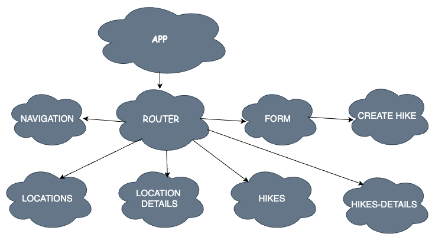

# Colorado Hikes

## Date: 10/19/22
### By: Thomalita Burbank
#### [Heroku](https://colorado-hikes.herokuapp.com/)[GitHub](https://github.com/thomalita/ColoradoHikes) | [Trello](https://trello.com/b/kScL36IN/denver-hikes)
***

### ***SCENIC HIKES***
Will show hikes with different levels (beginner, moderate, hard). Details such as (Miles, Location, scenic view if it includes a lake, waterfall or just trees)
***

### ***Getting Started***
* Building charts for front-end and back-end 
* Research hikes in different locations, gather details
     * Location
     * Difficulty
     * Miles
     * Image
     * Details

***

### ***Techologies Used***
* Trello Board - Checklist
    * [Trello Project Link](https://trello.com/b/kScL36IN/denver-hikes)
* DrawIO Chart
    * Hierarchy Diagram
    * ERD Diagram

***
### ***Screenshots***

#### ***Component Hierarchy Diagram***

#### ***Entity Relationship Diagram***
.png)

***Lake Haiyaha Denver, Colorado***

### ***Credits***
##### Images: [DuckDuckGo Search](http://www.duckduckgo.com)

##### Diagrams: [DrawIO](https://app.diagrams.net/)

***